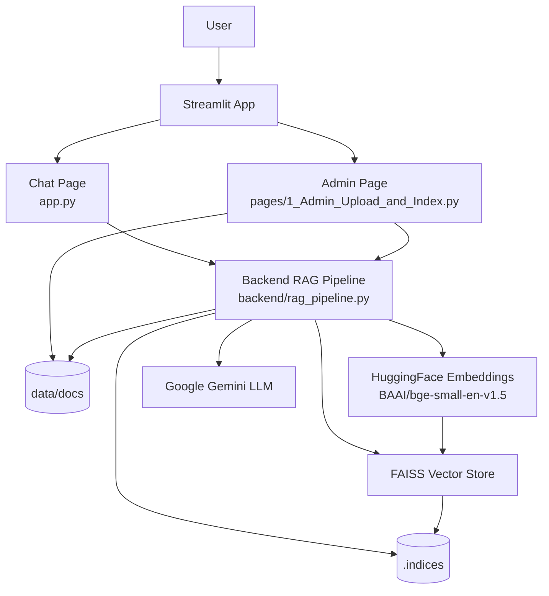

# Streamlit RAG App - Component and Architecture Documentation

This document explains each component of the `streamlit_rag_app` project, how data moves through the system, and how indexing and Q&A work end to end.

## 1) Purpose of the application

The app provides:

- A **chat interface** for asking questions over locally indexed PDF documents.
- An **admin interface** for uploading PDFs and creating local FAISS vector indexes.
- A **backend RAG pipeline** that handles document processing, indexing, retrieval, and LLM answer generation.

The design is intentionally local-first:

- PDFs are saved on disk in `data/docs/`.
- Vector indexes are saved on disk in `.indices/`.
- Index reuse is controlled by content fingerprinting (hash + file metadata + chunking settings + embedding model).

---

## 2) Project structure and component responsibilities

### `app.py` (Chat UI)

Role:
- Main Streamlit page for conversational Q&A.

Responsibilities:
- Loads available indexed documents via `list_indexed_documents()`.
- Displays chat history using `st.session_state`.
- Accepts user question from `st.chat_input`.
- Calls `ask_question_across_documents(question, k=4)` to retrieve and answer.
- Appends source document names to the answer for transparency.

Key behavior:
- If no indexes exist, it stops early and asks user to index documents from Admin page.

### `pages/1_Admin_Upload_and_Index.py` (Admin UI)

Role:
- Streamlit page for ingestion and indexing operations.

Responsibilities:
- Accepts PDF uploads (`accept_multiple_files=True`).
- Exposes indexing controls:
  - `chunk_size`
  - `chunk_overlap`
  - `force_rebuild`
- Saves uploaded files with `save_uploaded_file()`.
- Triggers indexing with `build_or_load_index()`.
- Shows list of indexed documents.

Key behavior:
- Handles per-file success/failure independently so one failed file does not block all files.

### `backend/rag_pipeline.py` (Core RAG logic)

Role:
- Central business logic for embedding, indexing, retrieval, and LLM generation.

Main constants:
- `EMBEDDING_MODEL_NAME`: `BAAI/bge-small-en-v1.5`
- `INDEX_ROOT`: `.indices`
- `DOC_ROOT`: `data/docs`

Main functions:
- `get_embeddings()`
  - Creates HuggingFace embedding model instance.
- `_file_fingerprint(path)`
  - Builds SHA256 fingerprint + size + mtime metadata.
- `_index_key(pdf_path, chunk_size, chunk_overlap, model_name)`
  - Produces deterministic index key for caching/reuse.
- `save_uploaded_file(file_name, file_bytes)`
  - Writes uploaded PDF to `DOC_ROOT`.
- `build_or_load_index(...)`
  - Reuses existing index if available and rebuild not forced.
  - Otherwise:
    1. Load PDF with `PyPDFLoader`
    2. Split text (`RecursiveCharacterTextSplitter`)
    3. Generate embeddings
    4. Build FAISS index
    5. Save index + `meta.json`
- `list_indexed_documents()`
  - Reads all `.indices/*/meta.json` files and returns normalized metadata rows.
- `ask_question(index_dir, question, k=4)`
  - Single-index retrieval + LLM generation (available, but chat UI currently uses cross-document mode).
- `ask_question_across_documents(question, k=4)`
  - Multi-index retrieval:
    1. Load every saved index.
    2. Run similarity search in each.
    3. Merge all hits.
    4. Sort by score (lower score = closer match).
    5. Keep global top-k chunks.
    6. Send combined context to Gemini for final answer.
    7. Return answer + source document names.

### `README.md`

Role:
- Basic setup and run instructions.
- High-level workflow for admin indexing + chat querying.

### `requirements.txt`

Role:
- Python dependencies for Streamlit + LangChain + FAISS + embeddings.

---

## 3) Architecture diagram



---

## 4) Flow diagram (end-to-end)

```mermaid
flowchart TD
    A1[Admin uploads PDF(s)] --> A2[Save file to data/docs]
    A2 --> A3[Compute fingerprint + index key]
    A3 --> A4{Index exists<br/>and force_rebuild = false?}
    A4 -- Yes --> A5[Reuse existing local index]
    A4 -- No --> A6[Load PDF + split chunks]
    A6 --> A7[Embed chunks]
    A7 --> A8[Build FAISS index]
    A8 --> A9[Save index + meta.json in .indices]
    A5 --> B1[Chat asks question]
    A9 --> B1

    B1 --> B2[List all indexed documents]
    B2 --> B3[Run similarity search per index]
    B3 --> B4[Merge + rank global top-k chunks]
    B4 --> B5[Build context string]
    B5 --> B6[Prompt Gemini with question + context]
    B6 --> B7[Return answer + source document names]
    B7 --> B8[Render response in chat UI]
```

---

## 5) Data model and storage

### Uploaded files
- Location: `data/docs/`
- Naming: original uploaded filename (current behavior overwrites if same filename is uploaded again).

### Index storage
- Location: `.indices/<index_key>/`
- Contains:
  - FAISS index files (`index.faiss`, etc. created by FAISS save).
  - `meta.json` with:
    - `pdf_path`
    - `chunk_size`
    - `chunk_overlap`
    - `embedding_model`

### Why index keys are deterministic

Index key includes:
- File fingerprint (`sha256`, size, mtime),
- Chunking config (`chunk_size`, `chunk_overlap`),
- Embedding model name.

This guarantees a new index is created when relevant inputs change.

---

## 6) Retrieval and answer generation behavior

Current chat behavior is **cross-document retrieval**:
- Instead of selecting one PDF, it searches all indexed PDFs.
- It takes top-k chunks globally across indexes.
- It then asks the LLM to answer from only that retrieved context.
- UI also displays source document names for traceability.

Prompt policy:
- System instruction says: answer only from provided context, otherwise say unknown.

---

## 7) Configuration and runtime dependencies

Required environment variable:
- `GOOGLE_API_KEY`

If missing:
- Backend raises a clear error and UI shows it.

Main runtime dependencies:
- `streamlit` (UI)
- `langchain*` packages (pipeline + orchestration)
- `langchain-huggingface` + `sentence-transformers` (embeddings)
- `faiss-cpu` (vector store)
- `langchain-google-genai` (Gemini integration)
- `pypdf` (PDF parsing)

---

## 8) Operational notes

- First indexing run can be slower due to embedding model load.
- Query latency grows with number of indexes because cross-document mode loads/searches each index.
- Local disk persists indexes, so app restart does not require re-indexing.

---

## 9) Known improvement opportunities

- Add document delete/re-index controls in Admin page.
- Prevent filename collisions (use UUID-based naming).
- Cache loaded indexes/embeddings in memory for faster repeated queries.
- Add per-chunk source attribution (page/chunk IDs) in answer output.
- Add optional single-document query mode toggle in chat.
